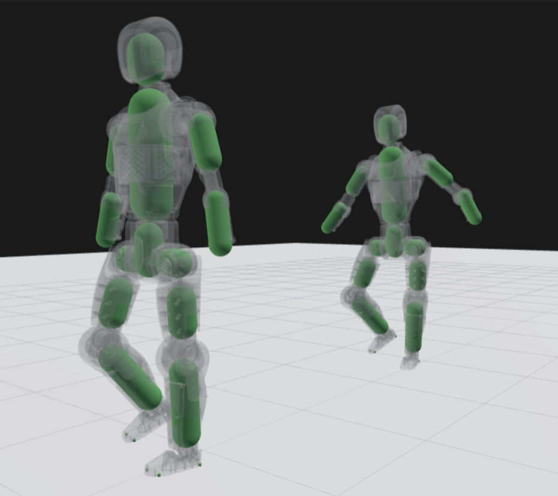

<p align="center">
  <h1 align="center">Asimov RGMT</h1>

  <p align="center">
    
    <a href="https://github.com/astral-sh/uv">
      
    </a>
    <a href="https://github.com/newton-physics/newton">
      
    </a>
  </p>

  <p align="center">
    A PPO motion-tracking trainer for the <a href="https://github.com/menloresearch/asimov-1">Asimov v1 humanoid</a>, implementing <a href="https://arxiv.org/abs/2601.23080"><em>Robust and Generalized Humanoid Motion Tracking</em></a> (RGMT) on top of <a href="https://github.com/newton-physics/newton">Newton</a> physics. This repository trains a dynamics-conditioned command-aggregation policy that outputs residual actions on top of PD tracking. Reference motions are GMR-retargeted AMASS clips produced by <a href="https://github.com/rsamf/asimov-gmr">asimov-gmr</a>.
  </p>

  <p align="center">
    <br>
    <sub>Rendering logged by <a href="https://github.com/rsamf/nebo">Nebo</a></sub>
  </p>

  <p align="center">
    <a href="#pretrained-model">Pretrained Model</a> •
    <a href="#quick-start">Quick start</a> •
    <a href="#evaluation">Evaluation</a> •
    <a href="#visualization">Visualization</a> •
    <a href="#architecture">Architecture</a>
  </p>
</p>

## Pretrained model

A trained policy is published at [`rsamf/asimov-rgmt-medium`](https://huggingface.co/rsamf/asimov-rgmt-medium). The "-medium" suffix indicates the highest level of difficulty seen in training, so this policy was trained on the easy and medium training splits of the asimov-gmr reference release only, not hard. On the 180-clip test split (60 easy, 60 medium, 60 hard) it scores in zero-shot:

| Metric | Value |
|---|---|
| Robust success rate (action noise 0.05, 3 repeats) | 75.4% ± 0.9 |
| Greedy success rate (no noise) | 75.0% |
| Easy / medium / hard success | 93.9% / 77.2% / 55.0% |
| MPKPE over successful episodes | 96.0 mm |
| Root-relative pose error | 51.9 mm |
| Commanded jitter | 20.5 mrad |

See [docs/results.md](docs/results.md) for the evaluation protocol, more detailed results, and the main findings from the training campaign.

```bash
# Download the checkpoint and evaluate it:
hf download rsamf/asimov-rgmt-medium asimov-rgmt-medium.pt --local-dir models/
uv run python scripts/eval_success_gated.py models/asimov-rgmt-medium.pt \
    --split rgmt/data/splits/medium.json --role test --action-noise 0.05 --repeats 3
```

## Quick start

Everything runs through `uv` (Python 3.12, CUDA 12.8 PyTorch wheels).

```bash
# 1. Bake a directory of retargeted clips into an on-disk cache (offline, run once):
uv run python -m rgmt.preprocess motion_dir=motions/ cache_dir=cache/

# 2. Train, sampling across all cached clips:
uv run python -m rgmt.train motion_cache=cache/

# 3. Or reproduce the released policy exactly (full recipe, 34,000 iterations):
uv run python scripts/train_medium.py --cache cache/
```

`rgmt.train` can also build a corpus on the fly from `motion_dir=` (a directory of `.npz` clips) or a single `motion_path=` clip; the precedence is `motion_cache > motion_dir > motion_path`. The offline cache is strongly preferred because it precomputes the expensive per-clip upsampling and forward-kinematics keypoints once. `resume_from=<ckpt.pt>` resumes a run (model, optimizer, and iteration counter).

To obtain training data, follow the [asimov-gmr](https://github.com/rsamf/asimov-gmr) pipeline. It turns your own AMASS copy into the exact reference release this repository trains on, including difficulty labels and the train/test split. AMASS itself carries a non-commercial research license and cannot be redistributed, which is why no motion data ships with either repository.

## Evaluation

The headline number is the success-gated robust evaluation: every clip is rolled from start to end (no reference-state-initialization sampling), and an episode succeeds if it reaches the clip end without a failure termination. Success is measured under action noise with repeats (`--action-noise 0.05 --repeats 3`) because single deterministic passes proved fragile as a metric. Tracking error (MPKPE) is reported only over successful episodes, so precision and survival are not conflated.

```bash
# THE metric (robust success rate):
uv run python scripts/eval_success_gated.py <ckpt.pt|pd> [n_envs] \
    --action-noise 0.05 --repeats 3

# Clean numerical eval (greedy, no noise):
uv run python scripts/eval_ckpt.py <ckpt.pt>

# Environment-step and update timing breakdown:
uv run python scripts/profile_throughput.py
```

`--split rgmt/data/splits/medium.json --role test` restricts evaluation to the held-out test set, and `--dump-clips` writes per-clip outcomes that `scripts/analyze_failures.py` can autopsy (it buckets clips by pass count and clusters failures by source dataset, length, survival depth, and reference speed).

## Visualization

See the robot in the Newton simulator with three input modes:

```bash
# Kinematic playback of a clip (what the motion data looks like, no physics):
uv run python -m rgmt.view --mode replay --cache cache/ --clip "CMU__41__41_05"

# Physics with zero residual action (pure PD tracking, the policy-free baseline):
uv run python -m rgmt.view --mode pd --cache cache/ --clip "CMU__41__41_05"

# A trained checkpoint tracking the clip (greedy, no command noise):
uv run python -m rgmt.view --mode policy --cache cache/ --ckpt models/asimov-rgmt-medium.pt
```

This opens a Newton GL window by default. Close it or press Ctrl-C to exit; clips loop unless `--no-loop` is passed.

| Flag | Meaning |
|---|---|
| `--mode replay\|pd\|policy` | Input mode: kinematic, zero-action PD, or trained checkpoint. |
| `--cache DIR` | Preprocessed corpus directory (or use `--motion-path clip.npz` for one raw clip). |
| `--clip NAME` | Clip to play (filename stem). The default is the first clip; `--list` prints all names. |
| `--ckpt FILE.pt` | Checkpoint for `--mode policy`. |
| `--viewer gl\|null\|rerun\|viser` | Viewer backend; `gl` opens a window and `null` is a headless smoke run. |
| `--steps N` / `--no-loop` | Limit the step count, or stop at the clip end instead of looping. |
| `--fps F` / `--headless` / `--device` | GL pacing, windowless GL, and CUDA device selection. |

`scripts/render_policy.py` renders a side-by-side reference-versus-policy MP4 offscreen, with no display needed.

## Architecture

Data flows as follows: `.npz` clips are loaded by `MotionRef.load` (upsampling 30 to 60 fps, finite-difference velocities, forward-kinematics keypoints), `rgmt.preprocess` bakes per-clip safetensors plus a manifest, `MotionCorpus` holds all clips as concatenated flat tensors, `TrackEnv` composes the simulator, corpus, and reward into the policy input bundle, and `PPOTrainer` optimizes `RGMTActorCritic`.

- **`rgmt/data/`** holds the data layer. `joint_map.py` is the canonical source of truth for the 23 actuated joint names in MJCF order plus the keypoint links. `motion.py` enforces the `.npz` contract described below. `corpus.py` provides clip-boundary bookkeeping over flat tensors, and `cache_key.py` keys the preprocess cache on source hash, URDF hash, frame rates, keypoint links, and schema version so unchanged clips are skipped.
- **`rgmt/env/`** holds the simulation layer. `sim.py` wraps Newton and mujoco-warp around the vendored robot asset in `rgmt/assets/asimov-v1/` (a freejoint plus 25 hinges: 23 actuated and 2 passive neck joints). `track_env.py` composes the simulator, corpus, and `reward.py` into the policy bundle, with exact shape contracts documented in its docstring: `obs (N,98)`, `history (N,10,98)`, `cmd_window (N,21,55)`, `critic_obs (N,187)` in the paper-base configuration. Training-time command noise (paper Table II) and the termination criteria live here. `domain_rand.py` implements per-environment dynamics randomization for sim-to-real transfer.
- **`rgmt/policy/`** holds `RGMTActorCritic`. A causal self-attention `HistoryEncoder` over the 10-step proprioception history produces a dynamics embedding, which the `CommandEncoder` uses as the cross-attention query over the 21-frame command window. The critic is asymmetric and sees privileged noise-free observations. The `RunningMeanStd` observation normalizer is part of the checkpoint.
- **`rgmt/algos/`** holds `PPOTrainer`: dual-clip PPO with a target-KL early stop, an optional KL-shock rollback guard, optional cosine or KL-adaptive learning-rate control, and optional action-smoothness regularizers.

Configuration is Hydra: `rgmt/configs/train.yaml` with groups `env/track`, `algo/ppo`, `network/rgmt`, and `reward/keypoint`. Comments in the config files record the reasoning behind tuning decisions; read them before changing reward weights or PPO hyperparameters.

## License

The code is licensed under the [Apache License 2.0](LICENSE). The published model weights are likewise Apache 2.0. Motion data is not included; AMASS and the SMPL-X body models carry their own non-commercial research licenses.

## Citation

This repository is an independent implementation of the RGMT paper. If you build on it, please cite the paper:

```bibtex
@article{ma2026rgmt,
  title   = {Robust and Generalized Humanoid Motion Tracking},
  author  = {Ma, Yubiao and Yu, Han and Xie, Jiayin and Lv, Changtai and Luo, Qiang and Zhang, Chi and Yin, Yunpeng and Xing, Boyang and Ren, Xuemei and Zheng, Dongdong},
  journal = {arXiv preprint arXiv:2601.23080},
  year    = {2026}
}
```
